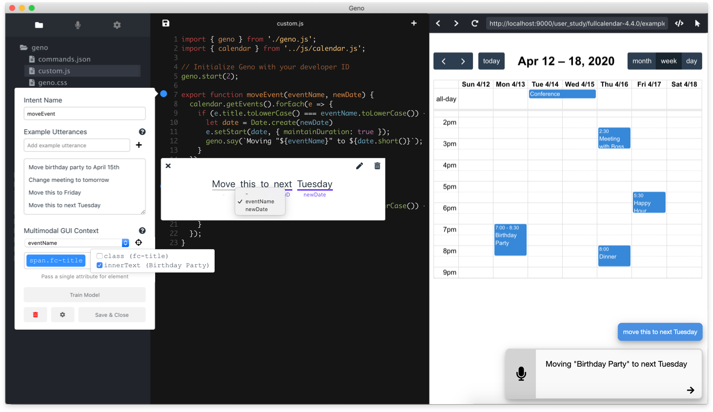

# Geno

Geno is a developer tool for adding voice input modality to existing web apps without requiring significant NLP expertise. It provides a high-level workflow for developers to specify functionalities to be supported by voice (intents), create language models for detecting intents and the relevant information (parameters) from user utterances, and fulfill the intents by either programmatically invoking the corresponding functions or replaying GUI actions on the web app. Geno further supports multimodal references to GUI context in voice commands (e.g. "move this [event] to next week" while pointing at an event with the cursor).

Check out our [UIST 2020 video](https://drive.google.com/file/d/1fNqGvEEulE4Jsbh-sF5SXMKhw2BAEyeL/preview) to see Geno in action. See the [paper](https://arxiv.org/abs/2007.09809), or [documentation](https://docs.google.com/document/d/1Tu7FbmXWysCZwJYgZSPlmJnMojC-0SAIBHDVTFtRKrM/edit#heading=h.bv51z1v7q9ks) for more details.

## Getting Started

1. Make sure you have [Node.js](https://nodejs.org/en/download/) installed
2. Download the code and navigate to the project directory.
2. Run `npm install` to install project dependencies
3. Run `npm start` to start the development server.
4. In a separate terminal session, navigate to the project directory and run `npm run electron` to start the Electron app.
    - If the new application window is blank, wait a few seconds to allow the development server to start and reload by going to View > Reload

Geno requires the corresponding [backend server](https://github.com/Dingln/geno_server) to be running for training and using voice models.

## Dependencies
The project is built using [Electron](http://electronjs.org) and [React](https://reactjs.org). 

